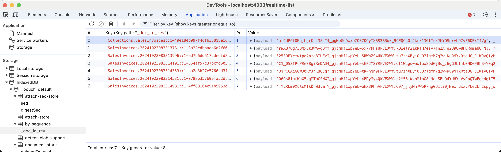

### Introduction

The `encrypt` method is used to encrypt the data before storing it in the database. The framework uses the `libsodium-wrappers` library to encrypt the data.

```ts
import { DatabaseManager } from 'pocketto';

DatabaseManager.connect('default', {
    encryption: true,
    encryptionPassword: '12345',
    silentConnect: false,
    dbName: 'default',
    adapter: 'idb',
});
```

All the data will be encrypted into `payload` field, so people will not be able to read the data directly from the database.


